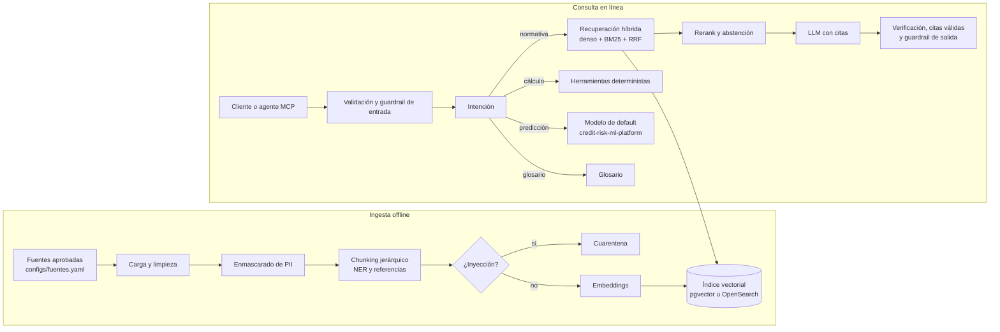
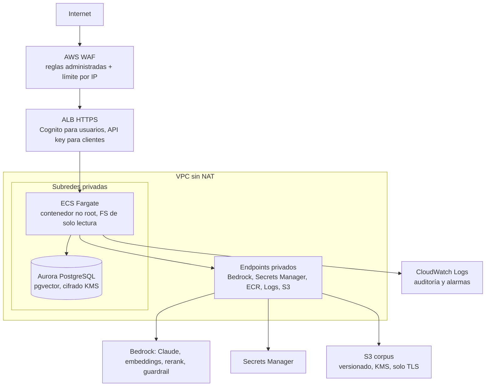

# Arquitectura

## Vista general

## Componentes y responsabilidades

| Capa | Módulo | Responsabilidad |
| --- | --- | --- |
| Configuración | `config.py` | Variables `RISKRAG_*`; backends intercambiables |
| Ingesta | `ingest/loaders.py`, `ingest/manifest.py`, `ingest/legal_chunker.py`, `ingest/pipeline.py` | Cargar, validar contra el manifiesto, limpiar, enmascarar, segmentar, poner en cuarentena |
| NLP | `nlp/normalize.py`, `nlp/entities.py`, `nlp/intent.py`, `nlp/query_expansion.py`, `nlp/verifier.py` | Tokenización en español, NER, intención, expansión, verificación |
| Recuperación | `retrieval/embeddings.py`, `retrieval/bm25.py`, `retrieval/vector_store.py`, `retrieval/hybrid.py`, `retrieval/reranker.py` | Denso + léxico, fusión RRF, filtro de vigencia, rerank |
| Generación | `generation/prompts.py`, `generation/llm.py`, `generation/answer.py` | Prompt versionado, LLM, citas, abstención |
| Seguridad | `security/*` | Validación, PII, inyección, guardrails, auditoría, límite de tasa |
| Herramientas | `tools/regulatory.py`, `tools/credit_model.py` | Clasificación, provisiones, cliente del modelo de default |
| Agente | `agent/orchestrator.py` | Enrutamiento local y agente con herramientas en Bedrock |
| Interfaces | `api/main.py`, `mcp_servers/*`, `cli.py` | REST, MCP y línea de comandos |

## Backends por entorno

| Pieza | Local (por defecto) | AWS |
| --- | --- | --- |
| Embeddings | `HashingEmbedder` (sin costo, no semántico) | Titan Text Embeddings V2 o Cohere Embed Multilingual v3 |
| Almacén | `InMemoryVectorStore` o pgvector en Docker | Aurora PostgreSQL Serverless v2 con pgvector |
| LLM | `ExtractiveLLM` (no alucina, línea base) | Claude en Bedrock (API Converse) |
| Rerank | `LexicalReranker` | Cohere Rerank 3.5 (API Rerank) |
| Guardrail | Reglas locales | Reglas locales + Bedrock Guardrails (ApplyGuardrail) |

## Despliegue en AWS

La infraestructura está en `infra/terraform/` y se explica en [09_despliegue_aws.md](09_despliegue_aws.md).

## Flujo de una consulta normativa

1. `sanitize_query` normaliza Unicode, quita caracteres invisibles y limita el tamaño.
2. El guardrail de entrada bloquea ataques y enmascara PII.
3. La consulta léxica se expande con el glosario; la consulta densa queda igual.
4. Se recuperan 20 candidatos densos y 20 léxicos, ambos filtrados por vigencia y dominio.
5. RRF fusiona los rankings; el reranker deja los 5 mejores con un puntaje comparable entre consultas.
6. Si el mejor puntaje está bajo `min_relevance`, se responde que no hay sustento.
7. El LLM recibe documentos delimitados, con id `C1..C5`, y la instrucción de tratarlos como datos.
8. Se eliminan citas inexistentes, se verifica cada oración y se aplica el guardrail de salida.
9. Se registra el evento de auditoría con la versión del prompt.
